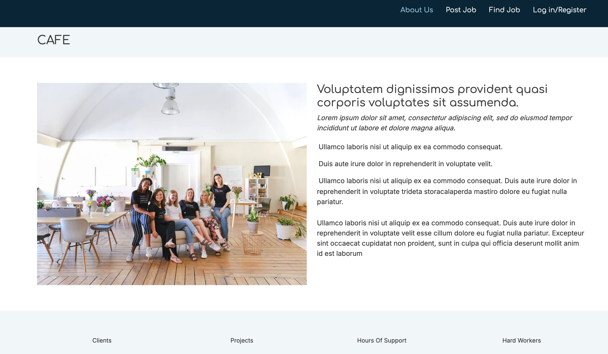
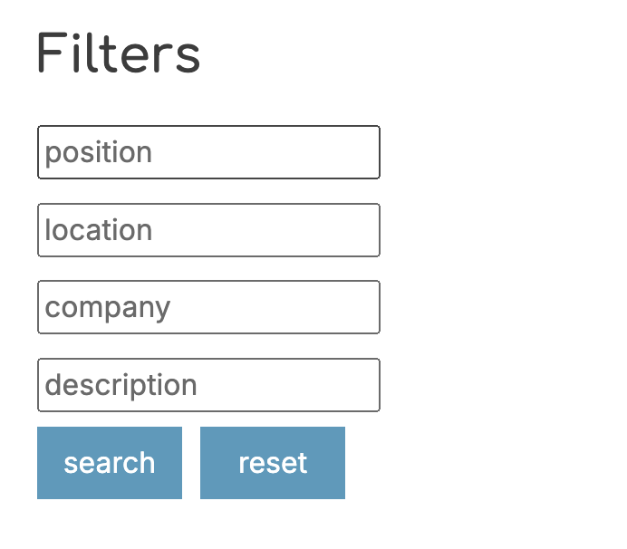
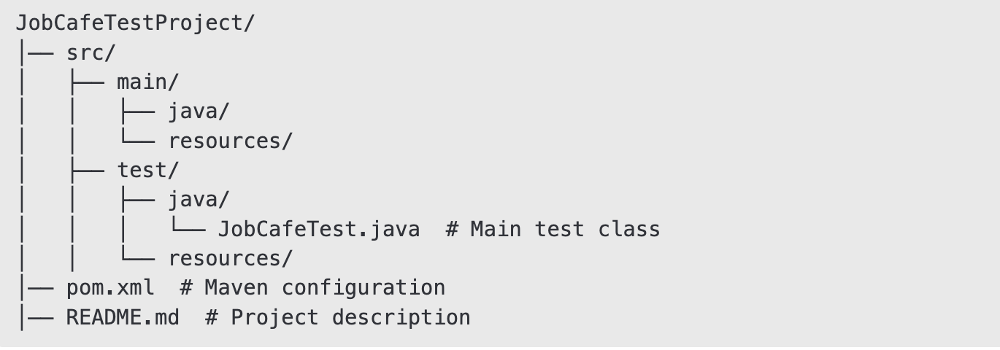

# JobCafe Selenium UI Test Automation

[JobCafe website](http://167.99.178.249:3000/)

## 📌 Project Overview
The JobCafe Automated UI Tests project is designed to ensure that key components of the JobCafe website work as expected. The tests cover the following functionalities:

- **Logo and "Coming Soon" Image Visibility**: Verifies that the logo and "Coming Soon" image are displayed correctly.
- **Navigation**: Tests navigation to the "About Us" page.
- **Search Functionality**: Validates the search functionality for jobs by position, location, and company.
- **Form Interactions**: Tests form behaviors, including reset functionality and error messages for invalid inputs.



## 🛠️ Technologies Used

- **Selenium WebDriver**: For browser automation and interaction with web elements.
- **JUnit 5**: For test execution and assertions.
- **WebDriverManager**: For managing WebDriver binaries.
- **Maven**: For dependency management and project build.

## 📂 Project Structure



## 🚀 How to Run Tests
### Install Dependencies
Ensure **Maven** and **JDK 13+** are installed.
**Chrome Browser**: Installed on your machine.

```bash
# Clone the Repository
git clone https://github.com/your-username/your-repository.git

# Navigate to the Project Directory
cd your-repository

# Build the Project Using Maven
mvn clean install

# Run the Tests
mvn test


